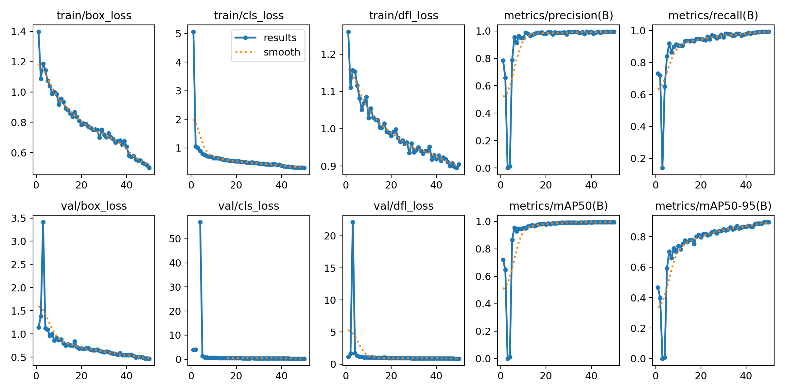

# 🚘 Indian License Plate Detection using YOLOv8

This project focuses on detecting Indian vehicle license plates using the YOLOv8 object detection model. It demonstrates the end-to-end pipeline including dataset collection, annotation, training, and evaluation.

---

## 📁 Dataset

- **Source:** [Indian Vehicle License Plate Dataset - Kaggle](https://www.kaggle.com/datasets/saisirishan/indian-vehicle-dataset/data).
- **Images:** 600 real-world images of vehicles registered in different Indian states.
- **Annotations:** The original dataset lacked annotations, so I manually annotated each image using [Roboflow](https://roboflow.com/).
- **Export Format:** YOLOv8-compatible format (`images/`, `labels/`, `data.yaml`).

---

## 🧠 Model: YOLOv8

- **Model Version:** `YOLOv8s` (Ultralytics)
- **Training:** Conducted for **50 epochs**
- **Input Size:** 640x640
- **Framework:** PyTorch via [Ultralytics YOLOv8](https://github.com/ultralytics/ultralytics)

---

## 🏋️ Training Pipeline

1. Annotated 600 images using Roboflow
2. Exported the dataset in YOLOv8 format
3. Trained YOLOv8s model using:
   ```bash
   yolo detect train data=data.yaml model=yolov8s.pt epochs=50 imgsz=640

## Results
<p align="center">  </p>
